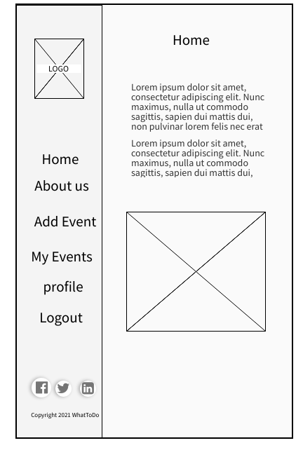
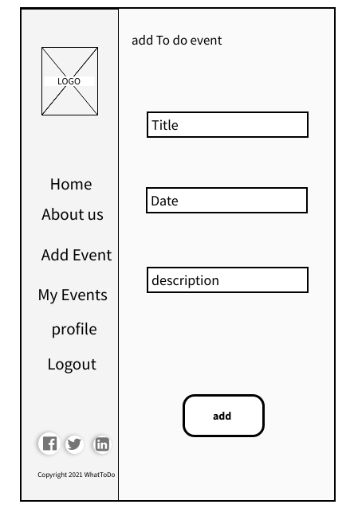
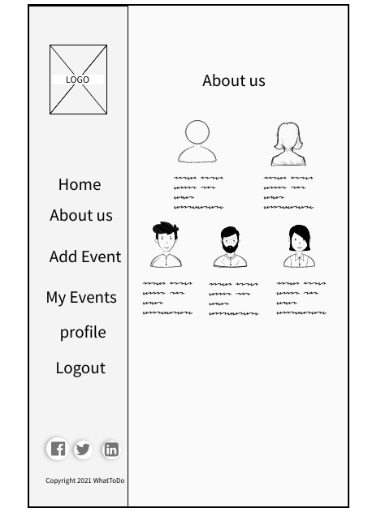
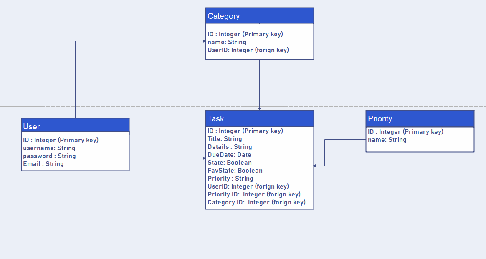
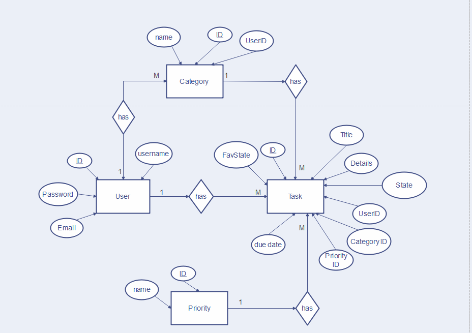

# What-To-Do :

Assistance in linking Task's and User's with relevant times  (Tasks , Users).

## Team members
## * Al-Shamikh Quraan (Team Leader)
## * Abdurrahman Abuata
## * Dima Zeqlam 
## * Ghaida Gharaibeh

 

# Wireframe

 

 

 

# Previously discussed ideas :

* A :
What-To-Do (approved).

This project is the least help we can give ourselves to organize our priorities and the most important work that we will do , we need to remind ourselves of the work that we must finish a little early and more than once. This project is based on facilitating the process of organizing our priorities and trying to ensure that they are completed on time faster than the usual methods by trying not to forget them or organize other work at the same time.

The minimum required is, The Users and Tasks should be linked in a simple and clear way. And the addition of operations that help determine the state of weather at the time of our required Task at the place where we want to do our work, it also provides a way to ensure that tasks is organized after done with them .

* B :
Sport news.

This project provides football fans with multiple football-teams, football-clubs in terms of the type and location of the them. The subscriber can bet on football games anywhere, anytime and in any way. By communicating with the other fans team through the application and sharing thair bets between them .

Providing direct contact by connecting the subscriber , with news from all football world hour by hour , Documenting the football team information from them location .

 
 

# PM Tools :

### * Project Name : What-To-Do.

### * GitHub Repository URL : 

- https://github.com/What-To-Do-Proj

### * Project management tool :

#### * Trello URL : 

- https://trello.com/b/zbo6jeAd/what-to-do-project

 
 

## * Software Requirements :

### Go to Software Requirements page : [Software Requirements](requirements.md) 

### Project management tool:
* Android studio.

* GitHub.

* Trello.

* Amplify Framework.

## Using a Database? Make an Database Schema Diagram

## Entity Realation Diagram

