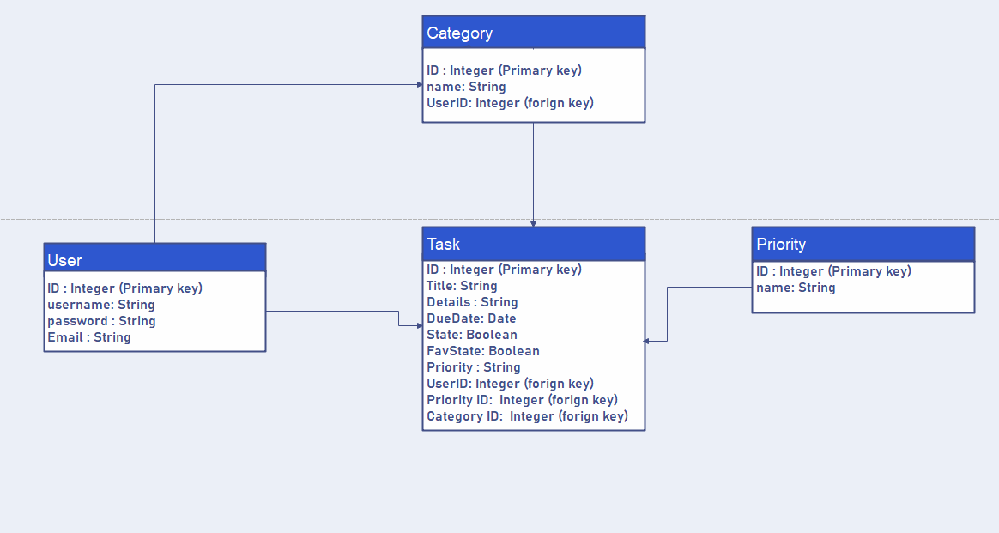
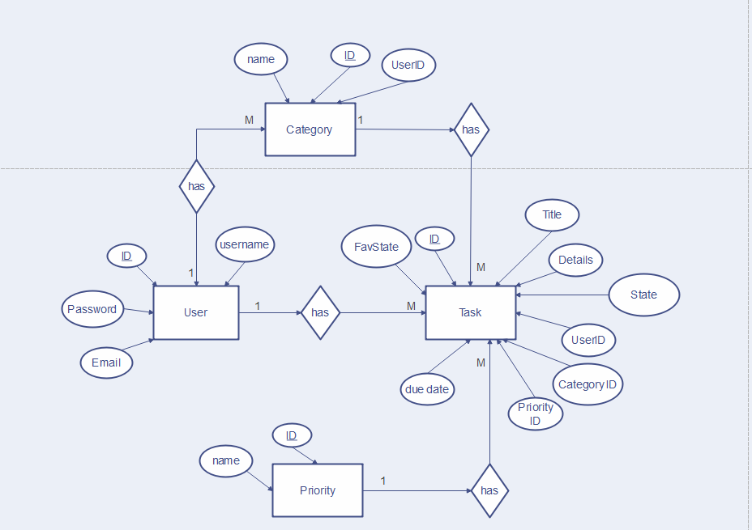

# Software Requirements

## Vision
To-do lists not only help you arrange your life schedules but also help you discover your unfulfilled wishes. It is not always possible to carry a pen and pencil wherever you go to note down your desires or tasks to-do list.

## Problem domain
Do you often feel completely overwhelmed with the amount of work you’ve got to do? Or you sometimes forget to do things that are important and people have to chase you to get things done.
Also, you find it a struggle to keep to deadlines. Luckily, there is something very simple you can do to keep your life and work more organized by using `WhatToDo`. Which is a list of tasks you need to complete, or things that you want to do.
 
## Importance of this project
One of the most important reasons you should use a to do list is that it will help you stay organised. When you write all your tasks in a list, they seem more manageable. When you’ve got a clear outline of the tasks you’ve got to do and those you’ve completed, it helps you stay focused.

## range (in/out)
#### In - what will your product do
The user will be able to make an account 
He will be able to add, edit and delete tasks
The user will be able to  view a (persisted) list of tasks.
 Users can select which tasks list priority wants to be displayed.
 User can Clear entire list
Add the weather API for our project .
 
#### OUT - What your product won't do
Our application only for android users We will not convert this application to ios app.
## Extended goals
We will try to let the users share their own to-do list .
We will try to let the users display tasks by category.
add sort feature for list items.
User can switch between dark and light mood
 
## functional requirements
Users
Signup: The user will be able to make an account 
Login: user can access the app service by username and password.
Logout: user  can logout by sending a request to end the current session.
Users can Add, edit and delete tasks.
Users can Add, edit and delete categories.
Users  can View tasks list.
 
 
 
## Non-Functional Requirements
### Security 
Use Intents for IPC, use sockets, named pipes, or shared files to  synchronously communicate with other apps installed on an Android device. These approaches are not only hard and inelegant, but also prone to threats. An easier and more secure approach to interprocess communication on the Android operating system is to use intents.
 
### performance
The application should run fast with no propagation, in order to provide the best services for all users.
 
### Ease of use
Our app will have a friendly interface that can be used by the different users. 
 
## Data flow

## Entity Realation Diagram

